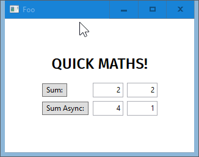

<h1 align="center">
<a href="https://github.com/girkovarpa/temps-lite">
</a><br/><br/>
temps-lite
<br/>
<br/>
</h1>

<h4 align="center">A simple but smart weather app.</h4>
<h5 align="center"></h5>

> temps-lite is a modern and minimal application based on Sciter with actual weather information and forecast for Windows, Mac and Linux.

<h1 align="center">
</a><br/><br/>
</h1>

## Features 🚀

- [x] Small filesize, ~10mb
- [x] Light memory footprint
- [x] Actual weather information for any location
- [x] Four-Day weather forecast
- [x] Information directly in your taskbar available
- [x] _Rain_, _snow_ and _thunder_ animations
- [x] Minimal and colorful design
- [x] Draggable
- [x] Minimizable

## Translations 🌍

- [x] Dutch
- [x] English
- [x] French
- [x] German
- [x] Italian
- [x] Spanish

## Todo 📋

- [ ] Interactive hourly weather graph
- [ ] Timezone support
- [ ] Shortcut Key support
- [ ] Autostart on login
- [ ] Move animations below forecasts layer
- [ ] Fix Apply/Quit button transitions

## Usage ▶️

Download the [Quark](https://quark.sciter.com/) executable corresponding to your operating system from the [Releases](https://github.com/GirkovArpa/temps-lite/releases).  If it's not available, simply run the appropriate Sciter binary inside this folder.  They can be downloaded [here](https://github.com/c-smile/sciter-sdk) under `bin.lnx`, `bin.osx`, or `bin.win`.

For example, on Windows, you could download [scapp.exe](https://github.com/c-smile/sciter-sdk/blob/master/bin.win/x32/scapp.exe), place it in this folder, and double-click it.  That's all there is to it!

On Linux, the process is similar.  Simply run [scapp](https://github.com/c-smile/sciter-sdk/blob/master/bin.lnx/x64/scapp) inside this folder, if your operating system is 64-bit.

## Location

Normally it is very straightforward to enter your location into the settings window in temps-lite: just type TOWN, COUNTRY and click "Apply". But what, if you live in a place, the name of which exists several times in your own country? The solution: Go to [OpenweatherMap](https://openweathermap.org/find?q=#) and enter the name of your city. In the case of multiple search results for your country you will see the geocoorcinates for the individula search results with their names. Right-click on the desired one and select 'Copy link address' from the menu. Paste it into the settings window of temps-lite. Delete everything before '&lat=' and click 'Apply'. You should now see the weather in your location.

Even more granular: The weather above your home! Go for example to [OpenStreetMap](https://www.openstreetmap.org/#map=6/51.330/10.453) and enter your home address. The map of your location will appear. Look for your house/apartment and right-click on it. Select 'Show address' from the menu. You will see the geocoordinates of it on the left side of the window. Copy them and paste them into the settings window of temps-lite. Delete everything from the beginning until after the first slash. Type '&lon=' without empty space in front of the first number. Delete the slash in front of the second one and insert '&lat=' (always without the quotes) instead. Click 'Apply', and that's it!

## Bugs 🐛

<details>
  <summary>Linux Font Installation</summary>
  
  On Linux, a console window may appear with the following error message:
  
  > warning:css: in @font-face statement, failed to install font at ...

  To resolve this issue, please install the fonts [Rubik Regular 400](assets/fonts/rubik/Rubik\%20Regular\%20400.ttf) & [Rubik Bold 700](assets/fonts/rubik/Rubik\%20Bold\%20700.ttf) manually, then delete (or comment-out) line `6` from [main.htm](main.htm):

  ```html
  <link href="rubik.css" rel="stylesheet">
  ```
</details>

## History 📜

This application was forked from the original [temps](https://github.com/jackd248/temps) repository.  Unlike that project, this one is based on [Sciter](https://sciter.com/) instead of Electron.

The weather icons are made by the [original author](https://github.com/jackd248). If you would like to use them in your own project, you can find the icons on [Github](https://github.com/jackd248/weather-iconic) or at the [Noun Project](https://thenounproject.com/konradmichalik/collection/weather/).

## Contributors ✨

Thanks goes to these wonderful people:

<table>
  <tr>
    <td align="center"><a href="https://github.com/4silvertooth"><br /><sub><b>4silvertooth</b></sub></a><br /><a href="https://github.com/GirkovArpa/temps-lite/commit/8a06af5921ea8005d49e9ac90e750ba912fa17cb" title="Code">💻</a> 
    <td align="center"><a href="https://github.com/papioara"><br /><sub><b>papioara</b></sub></a><br /><a href="https://github.com/GirkovArpa/temps-lite/issues/1#issuecomment-774692453" title="Translations">🌍</a><a href="https://github.com/GirkovArpa/temps-lite/pull/9" title="Bug Fixes">🐛</a></td>
  </tr>
</table>

## License []()

Copyright © 2016 Konrad Michalik, 2021 Girkov Arpa. This software is licensed under the [MIT License](LICENSE).

___
[](https://ko-fi.com/V7V43JLTO)
